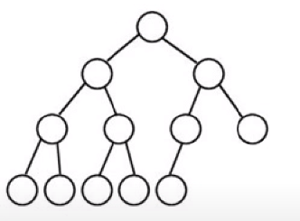

# 힙(heap)

생성일: 2020년 10월 4일 오전 11:01
최종수정일: 2021년 5월 25일 오후 9:16
태그: 강유정

## 힙이란?

- 완전 이진 트리

완전 이진 트리이면서 heap property를 만족하는 자료구조이다.

우선 순위 큐를 위한 것이다.

최댓값 혹은 최솟값을 쉽게 구할 수 있다.

마지막 레벨을 제외하면 완전히 꽉 차있고, 마지막 레벨에는 가장 오른쪽부터 연속된 몇 개의 노드가 비어있을 수 있다.

- 힙의 종류

최대힙 혹은 최소힙을 만족해야한다.

최대힙(max heap property) : 부모는 자식보다 크거나 같다. → 최대값을 찾는데 시간복잡도 O(1)

최소힙(min heap property) : 부모는 자식보다 작거나 같다. → 최소값을 찾는데 시간복잡도 O(1)

%208741a611cbbb4027acb83f65df121b1f/Untitled%201.png)

- 예시

%208741a611cbbb4027acb83f65df121b1f/Untitled%202.png)

(a)는 3가지 모두 다 완전이진트리와 최대 힙의 특성을 만족한다.

(b)는 완전이진트리지만 최대힙 혹은 최소힙 특성을 만족하지 않는다.

(c)는 완전이진트리가 아니다.

%208741a611cbbb4027acb83f65df121b1f/Untitled%203.png)

위의 힙은 동일한 데이터를 가지고 있지만 다르다. 즉 힙은 유일하지 않다.

## 힙의 구현

- 힙은 일차원 배열로 표현가능하다.
- 노드 개수가 n일 때 A[1...n]까지 사용한다고 하면
    - 루트 노드가 A[1]일 때
    - A[i]의 부모 = A[i/2]
    - A[i]의 왼쪽 자식 = A[2i]
    - A[i]의 오른쪽 자식 = A[2i+1]

%208741a611cbbb4027acb83f65df121b1f/Untitled%204.png)

## heapify

: 정렬할 배열을 힙으로 만들기! 삽입/삭제 연산 등이 발생했을 때 필요한 기본 연산이다.

이 알고리즘의 시간복잡도는 $O(h) = θ(logN)$이다. 

이 때 h는 트리의 높이, N은 노드 개수이다.

- 최대힙 heapify  = 내림차순 정렬

모든 노드들에 대해서 두 자식들 중 더 큰 쪽이 나보다 크면 자리를 바꾼다. 더이상 비교할 자식이 없거나 힙을 만족하게 되면 중단한다.

%208741a611cbbb4027acb83f65df121b1f/Untitled%205.png)

최대힙을 만드는 heapify 과정이다

## 정렬할 배열을 최대힙으로 만들기

: 제일 끝 리프 노드부터 보면서(배열을 거꾸로 탐색하면서) 처음으로 리프노드가 아닌 노드부터 heapify 연산을 수행한다. 아래 그림의 배열 인덱스로 치면 5부터 시작

(a) 인덱스 5의 값은 16이고 자식은 리프노드이므로 완전이진트리를 만족하고, 자식의 값은 7인데 자신보다 작으므로 아무일도 일어나지 않는다.(이미 힙을 만족하고 있는 상태이다.)

(b) 그 다음 인덱스인 4로 넘어간다. 자식 두 노드는 리프노드이므로 완전이진트리를 만족한다. 하지만 자신의 값인 2보다 자식노드 8, 9 중 더 큰 값인 14(인덱스 8)가 더 크므로 인덱스4와 인덱스 8의 값을 바꾼다.

(c) 그 다음 순서는 인덱스 3이다. 자식 노드 6,7 중 더 큰 값인 10이 자신의 값 3보다 크므로 인덱스 3과 인덱스 7의 값을 바꾼다.

(d) 그 다음 순서는 인덱스 2이다. 왼쪽 서브트리가 이미 힙이고, 오른쪽 서브트리도 이미 힙이다. 그렇다면 값을 비교한다. 인덱스 4, 5 중 더 큰 값인 16보다 1이 더 작으므로 인덱스 2와 인덱스 5의 값을 바꾼다. 그러면 인덱스 5의 값은 1이 되는데, 자식노드인 인덱스10을 보면 1 < 7 이므로 인덱스 5와 인덱스 10의 값을 바꿔서 (e)의 그림이 된다.

(e) 마지막 순서는 인덱스 1(루트노드)이다. 4 < 16 이므로 인덱스 1과 인덱스 2의 값을 바꾸면 인덱스2의 값은 4이다. 4 < 14 이므로 인덱스 2와 인덱스 4의 값을 바꾼다. 그리고 4 < 8 이므로 인덱스 4와 인덱스 9의 값을 바꾼 그림이 (f)이다.

%208741a611cbbb4027acb83f65df121b1f/Untitled%206.png)

## 힙의 삽입

최대힙에 새로운 요소 삽입하기!

N이 노드의 개수라면, 시간복잡도는 $O(log N)$

1) 새로운 노드를 힙의 마지막 노드에 이어서 삽입한다.

2) 자신의 부모노드와 값을 비교하여 내가 더 크면 부모와 값을 바꾼다.

2번을 힙이 완성될 때까지 반복한다.

ex)

%208741a611cbbb4027acb83f65df121b1f/Untitled%207.png)

30을 제일 끝에 삽입 → 부모인 20과 비교하여 스왑 → 부모인 21과 비교하여 스왑 → 최대힙이 만들어졌으므로 삽입 종료

## 힙의 삭제

힙에서 삭제는 

최대힙에서 최댓값을 가진 노드(root)를 삭제 or 최소힙에서 최소값을 가진 노드(root)를 삭제하는 것

N이 노드의 개수라면, 시간복잡도는 $O(log N)$

1) 루트 노드 제거

2) 루트자리에 가장 마지막 노드 삽입

3) 루트와 자식 크기를 비교하여 heapify!

ex1) 최대힙 삭제

%208741a611cbbb4027acb83f65df121b1f/Untitled%208.png)

루트를 제거하고 가장 끝에 있는 2를 루트에 삽입한다. 2의 자식들인 15와 20 중 큰 값인 20은 2보다 크므로 20과 2를 스왑한다. 최대힙이 만들어졌으니 삭제연산을 종료한다.

ex2) 최소힙 삭제

%208741a611cbbb4027acb83f65df121b1f/Untitled%209.png)

                                          (a)                                                                         (b)

%208741a611cbbb4027acb83f65df121b1f/Untitled%2010.png)

                                          (c)                                                                          (d)

최소값(root) 삭제 → 제일 끝에 있는 27을 루트에 삽입 → 자식 중 더 작은 값인 9보다 27이 크므로 9와 27을 스왑 → 자식 중 더 작은 값인 14보다 27이 더 크므로 14와 27 스왑 → 자식 중 더 작은 값인 17보다 27이 더 크므로 27과 17 스왑 → 최소힙이 완성되었으므로 종료
